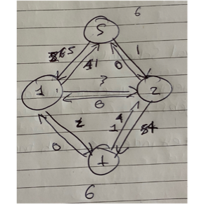
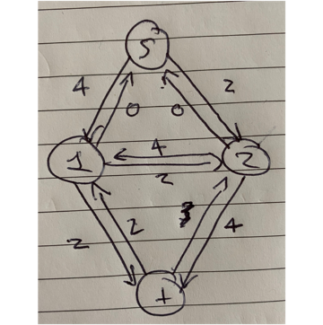

# **Advanced Algorithms Exam**

**Full name**: Joshua Everett

**URN**: 6621182

## **Question 1**

(a) **What is the maximum revenue for a pole of length 2?**

- You can have 2 cuts of length 1 which gives the max value of 6

(b) **What is the maximum revenue for a pole of length 3?**

- You can have 1 cut of length 3 which gives the max value of 11

(c) **Give a recurrence relation that gives the maximum revenue r(k) in terms of smaller sub-problems, or as a base case.**

$r_k = max(p_i + r_{k-1}), 1 <= i <= k$

(d) **Using your recurrence relation from part (c), calculate the table needed to find r(10), the maximum revenue for a pole of length 10.**

| **Length k** | **r(k)** | Cuts    |
| ------------ | -------- | ------- |
| 0            | 0        | 0       |
| 1            | 3        | 1       |
| 2            | 6        | 1+1     |
| 3            | 11       | 3       |
| 4            | 14       | 4       |
| 5            | 17       | 4+1     |
| 6            | 22       | 3+3     |
| 7            | 25       | 3+3+1   |
| 8            | 28       | 3+3+1+1 |
| 9            | 33       | 3+3+3   |
| 10           | 36       | 3+3+4   |

(e) **What length pieces could a pole of length 10 be cut into to obtain the maximum revenue? Give one solution that leads to the maximum revenue**

- Lengths 3 + 3 + 4  will have a total length of 10 and give the max value of 36

## **Question 2**

(a) **What is the time complexity of this greedy algorithm?**

Sorting takes O(n log n), adding each item will take O(n) time as it has to iterate the list of items, because O(n log n) > O(n), that becomes the time complexity therefore time complexity

-  O(n log n)

(b) **Apply the greedy algorithm to the following set of items. What does the algorithm return?**

The items are ordered as [C,A,B,F,E,D], they are ordered by smallest w_i + s_i (sum of weight plus strength)

D is added to the stack first, the stack can now hold 25 weight

E is then stacked on D, E has a weight of 7 so the remaining strength of D is is 25-7 = 18, E has a strength of 17

F is stacked on E, so D has a remaining strength of 18-8 = 10, E has a remaining strength of 17-8 = 11, F has strength of 9.

B is stacked on F, so D has remaining strength of 10-3 = 7, E has remaining strength of 11-3 = 8, F has remaining strength of 9-3=6.

A is stacked on B, so D has remaining strength of 7-1=6, E has remaining strength of 8-1 = 7, F has remaining strength of 6-1=5, A has strength of 8.

C is stacked on A, so D has remaining strength of 6-5=1, E has remaining strength of 7-5=2, F has remaining strength of 5-5=0 therefore depending on the rules of the algorithm it would crumble if it defines insufficient as strength being equal to 0 but if insufficient strength means the strength is less than 0, It would not crumble.

- if Insufficient means 'strength <= 0' the set returned would be [A,B,F,E,D]

- If insufficient means 'strength < 0' the set returned would be [C,A,B,F,E,D]

- My opinion would be that insufficient strength means 'strength <= 0' therefore the set returned would be [A,B,F,E,D]

(c) **If a non-crumpling stack contains X immediately before Y at some point in the stack, but with sx + wx > sy + wy, , show that the same stack except with the positions of X and Y exchanged is also non-crumpling**

$stack= [..., s_1, ..., x , y , s_n]$

​                  {..., s_1} = weight w

$s_x + w_x > s_y + w_y$

Non crumpling => 

$s_x >= w$

$s_y >= w + w_x$

Hence

$s_y >= w$

$s_x > s_y + w_y - w_x$

$> (s_y - w_x) + w_y$

$>= w+w_y $

Hence

- [..., y, x ...] is not crumpling

(d) **Explain briefly (by considering inversions or otherwise) why the result of part (c) means that this greedy algorithm does indeed give the correct solution**

If there is a non-crumpling stack then there is one with minimal number of inversions from this ordering. And if non-zero number of inversions then can reduce giving the correct solution.

(e) **If the algorithm terminates with “not possible”, then is it the case that the sequence returned is a maximal set of items that can be stacked without crumpling? Justify your answer.**

Yes this is the case because a greedy algorithm makes the optimal decision at each stage of the algorithm therefore it ensures that the set of items returned is optimal set of items that wouldn't crumple ensured by the decision previous to the one that returned not possible.

## **Question 3**

(a) **Apply the Ford-Fulkerson algorithm to compute the maximum flow from s to t in the following network. Show your working and state the maximum flow.**

Residual graph below shows the steps of the algorithm and how the maximal flow was calculated, with the final graph showing the final steps of the algorithm.

 

 

maximum flow from s->t = 6

(b) **Give a cut in the network of minimal capacity, and justify why it is minimal.** 

{s} = 6 + 1 = 7

{s , 1} = 1 + 3 + 2 = 6

{s, 2} = 6 + 5 = 11

{s, 1, 2} = 1 + 2 + 5 = 8

Therefore min cut = {s, 1} where node 1 is the node connected to S on the left side with a capacity of 6.  This is minimal because the other cuts would have a larger capacity than the cut {s,1}

(c) **The following network contains not only capacities, but also minimal flows along each edge. For example, the edge labelled [1,2] must have a flow of value between 1 and 2. Is there a flow from s to t that satisfies all of the labels on the edges? Justify your answer.**

 

The graph above shows that this cannot be achieved as to satisfy all labels on the edges in the graph, edge s-> 1 or edge s->2 would require 1 unit of additional capacity so that edge 2->t could be satisfied. Currently there is only 4 units flowing through the edge 2->t where there needs to be 5. 

We can also tell that this will not satisfy the edges in the graph as there is a min requirement of 7 units of flow going into the node t (destination node) and there is only a maximum of 6 units of flow coming out of the sink node.

Therefore there is no flow that satisfies all of the lables in the graph.

## **Question 4**

(a) **What is the “maximal independent set” problem?** 

The maximal independent set problem is the task of finding the largest independent set in a graph, where an independent set is a set of nodes / vertices  that do not directly share an edge / are adjacent.

(b) **Find a solution to the “maximal independent set” problem on the following graph, and justify why your solution is maximal.**

Maximal sets:

- {E,F,C,D,H}

- {I, H, G, A, E}
- {J,G,I,E,H}
- {A,K,E,I,G}
- {G,I,E,H,A}

As there is no other set that is larger in size/length than the sets above.