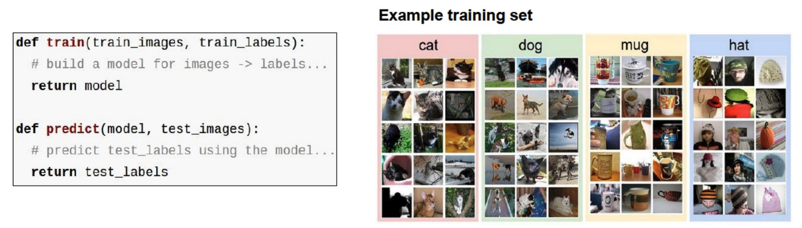
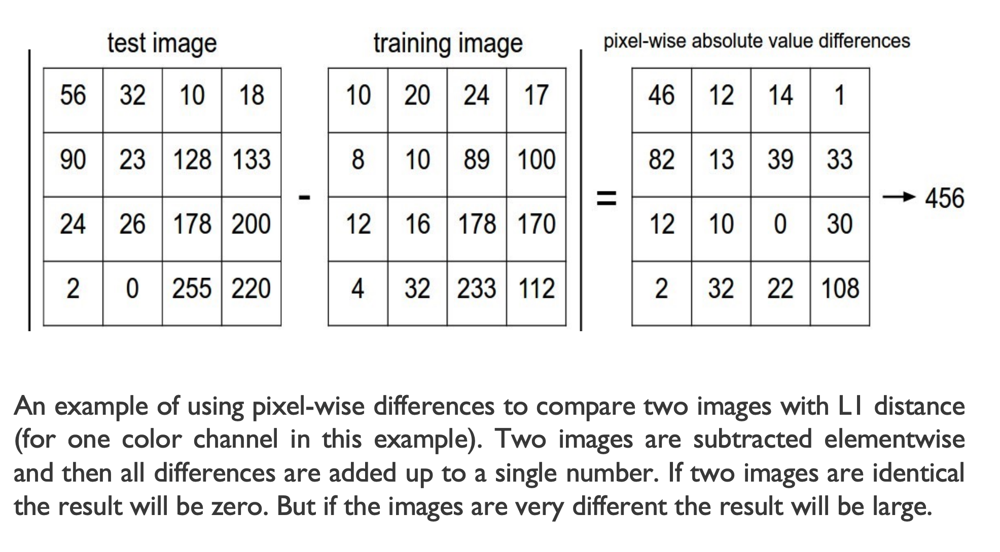
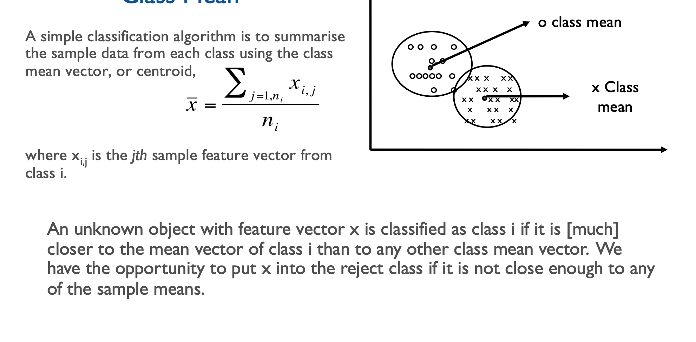
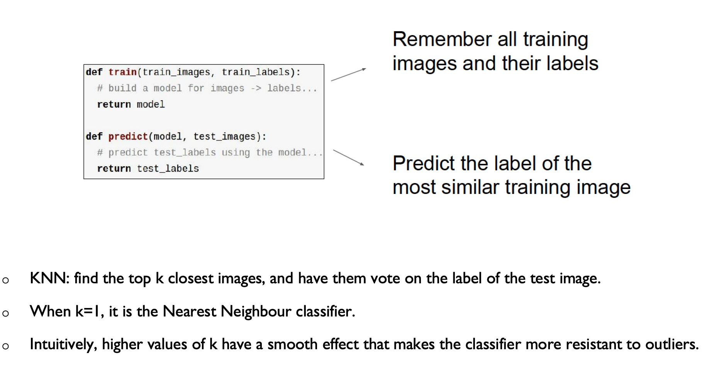
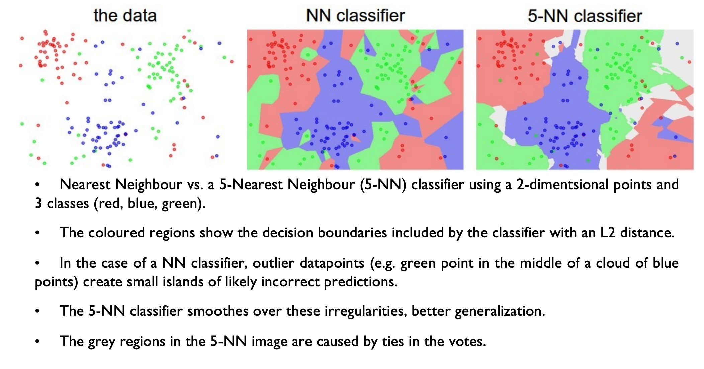
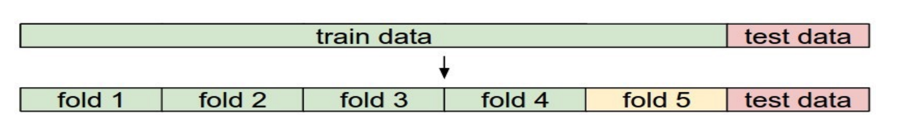
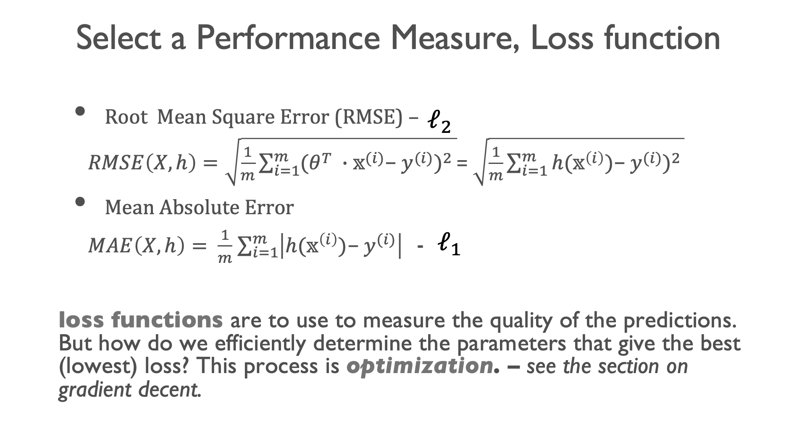

# Week 1


## What is Intelligence?

- Ability to **understand** and **learn** things.
- Ability to **think** and understand instead of doing things by instinct or automatically
- Ability to **solve** problems and to **make decisions**


## What is AI?

- Field of science and engineering whose goal is to create intelligent machines.

- AI automates intellectual tasks and is therefore potentially relavent to any sphere of human intellectual activity. 

  

## Machine learning pipeline and fundamentals

#### **Overview**

- We start with a simple algorithm, in the area of visual recognition, **K-Nearest Neighbour (KNN)**, as a machine learning example.

- Introduce concepts of:

  - Training, validation, and testing

  - Similarity measure

  - Cross-validation

  - Hyperparameter tuning

  - Confusion matrix

  - Overfitting and underfitting

    

#### Visual recognition 

- Detect object categories - person, glass, drinking, indoor

- Localisation of object categories - bounding boxes around category instances

- Semantic segmentation of object categories - which pixel belong to which category (i.e detect all pixels belonging to car category)

- Instance segmentation - which is which, e.g set of pixels belongs to red card

  

#### Image clasification

GIven a set of discrete labels classify which one an image relates to

**The problem** - the images are represented as 3D arrays of numbers,  with integers between [0,255]

**Challenges**:

- Viewpoint variation
- Deformation
- Occulusion
- Illumination
- Background clutter
- Intraclass variation

**Data driven approach**

1. Collect a dataset of images and lables
2. Use machine learning to train an image classifier
3. Evaluate the classifier on a withheld set of test images



**Common model elements for classification and pattern recognition**

- Classes (labels)
- Feature extractor
- Classifier (model)

Objects are classified based on the set of features extracted. Similarity between objects implies that they contain similar features, whcih in turn form clusters.

**Feature Extractor**

- Extracts information relavent to classification from data
- In image data, there are quite a few measures that can be used as features, such as RGB colour, colour histogram, Histogram of Gradients, texture, etc.
- Learned features: features can be learned through a learning model

**Feature Representation**

- Object may be compared for similarity based on their feature representation (e,g in the form of vector or matrix)
- Similarity can be derrived from the difference between a specific set of features or all of them by the distance they are away from one another

**How to compare data**

- If no particular features are extracted, we can use pixels as a set of features
- We can compare 2 images by comparing the images pixel by pixel and add up all the differences
- In other words given 2 iages and representing them as vectors $l_1$ and $l_2$, where $l_1$, $l_2$, either are extracted features or the raw pixels;

**L1 Distance**: $d_1(I_1, I_2) = \sum_{p} | I^p_1 - I^p_2|$



**L2 Distance**: Euclidean distance

$d_2(I_1, I_2) = \sqrt{ \sum_{p} (I^p_1 - I^p_2)^2 }$

- L2 Distance which has the geometric interpretation of computing the euclidean distance between two vectors
- This compute pixelwise (or image featurewise) difference as before, but this time we square all of them, add them up and finally take the square root
- L1 and L2 distances are the most commonly used special cases of a p-norm.


#### A simple classifier: Nearest Class Mean




## Classification using the K-Nearest Neighbours

```
Procedure K_Nearest_Neighbours(x, S)
{
  make A empty;
  for (all samples si in S)
  { 
  	d = Euclidean distance between si and x;
    if (A has less than k elements ) { 
    	insert (d, si) into A;
    }
    else if (d is less than max A){ 
    	remove the max from A;
    	insert (d, si) in A;
    }
  }
  assert A has k samples from S closest to x;
  if (a majority of the labels si.c from A are class c0 ){
  	classify x to class c0; 
  }
  else{
  	classify x into the reject class
  }
  return (class_of_x)
}
```

**Explanation**

Compute the k nearest neighbours of x and return the majority class S is a set of n labelled class samples si where si .x is a feature vector and si.c is its integer class label. x is the unknown input feature vector to be classified. A is an array capable of holding up to k samples in the sorted order by distance d. The value returned is a class label in the range [1,m]






#### Which K to use

- The k-nearest neighboar classifier requires a setting for k
- There are many differnet distance functions we can use (L1 norm, L2 norm ... e.g dot products)
- These choices are called hyperparameters and is not obvious what values/ settings one should use

#### Hyperparameter Tuning

The **test set** should never be touched until one time at the very end. **Otherwise** you may tune your hyperparameters to work well on the test set, but the trained model could have a significantly reduced performance. In practice, we would say that you **overfit** to the test set. **Should** use the test set only once at the end, it remains a good proxy for measuring the generalization of your classifier.

#### Cross-validation

- When the size of the training data (therefore the validation data) might be small, cross-validation can be used for hyperparameter tuning.
- For example, instead of arbitrarily picking the first 1000 datapoints to be the validation set and rest training set, k can be estimated with less noise by iterating over different validation sets and averaging the performance across these.
- In 5-fold cross-validation, we would split the training data into 5 equal folds, use 4 of them for training, and 1 for validation. We would then iterate over which fold is the validation fold, evaluate the performance, and finally average the performance across the different folds.




#### Summary on KNN

- Train and evaluate the kNN classifier on the validation data (for all folds, if doing cross-validation) for many choices of k (the more the better) and across different distance types (L1 and L2)
- Take note of the hyperparameters that gave the best results. There is a question of whether you should use the full training set with the best hyperparameters, since the optimal hyperparameters might change if you were to fold the validation data into your training set (since the size of the data would be larger). In practice it is cleaner to not use the validation data in the final classifier and consider it to be *burned on estimating the hyperparameters*.
- Evaluate the best model on the test set. Report the test set accuracy and declare the result to be the performance of the kNN classifier on your data.


## Types of Machine Learning Systems

- Supervised, unsupervised, semi-supervised and reinforcement learning
- Online or batch learning: whether or not they can learn incrementally or on the fly
- Instance-based versus model-based learning: whether they work by simply comparing new data points to known data points, or instead detect patterns in the training data and build a predictive model 
- Combination of above

#### Supervised Learning

- Supervised: training data with desired solutions (labels)

Examples:

- K-NN: K nearest neighbour
- Linear regression
- Logistic regression
- Support vector machines
- Decision trees and random forests
- Neural Networks*

#### Unsupervised Learning

- Unsupervised: training data without desired solution, no teacher
- Clustering (k-means, hierachical clustering etc)
- Visualisation and dimensionality reduction
  - Principle Component Analysis
  - t-distributed Stochastic Neighbour Embedding 
- Non-Matrix Factorisation
- Neural Network (self-organising map)

#### Semi-supervised Learning

- Some algorithms can deal with partially labelled training data.
- Example: whne you upload all your family photos to a software, it automatically recognise that same person A shows up in some photos and B shows up in another group of photos (through unsupervised approach). Then all you need to do is tell it who these people are, one label per person.

#### Reinforcement Learning

- Reinforcement Learning: the learning system, called an agentm can observe the environment, select and perform actions, and get rewards in return (or penalties in form of negative rewards).
- It must then learn by itself what is the best strategy, called a policy, to get the most reward over time. A policy defines what action the agent should choose when its in a given situation.





## Multiclass Classification

- Multiclass classifiers (multinomial classifiers)
- Error analysis - confusion matrix


#### Main challenges of machine learning

- Insufficient quantity of training data
- Non-representative training data
- Poor quality data
- Irrelevant features
- Overfitting the training data
- Underfitting the training data