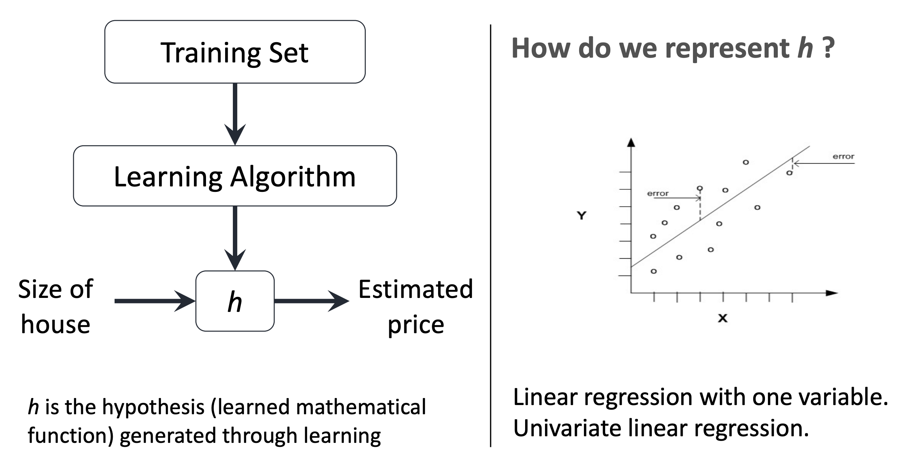
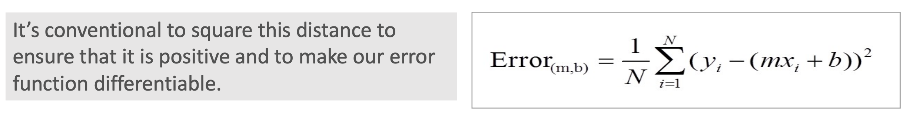
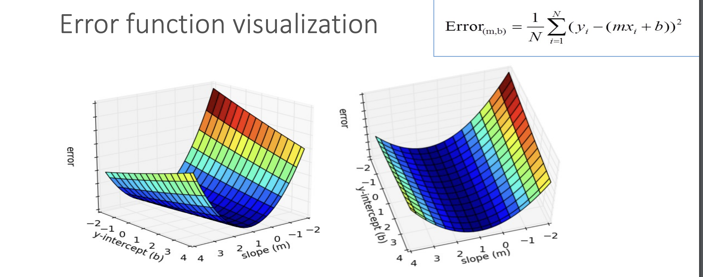
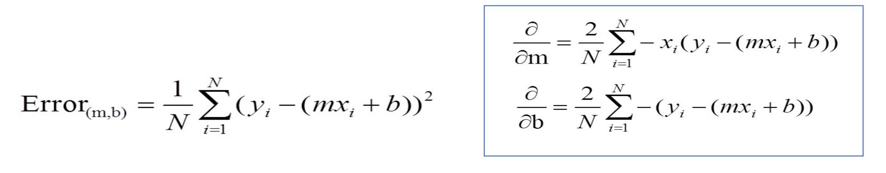
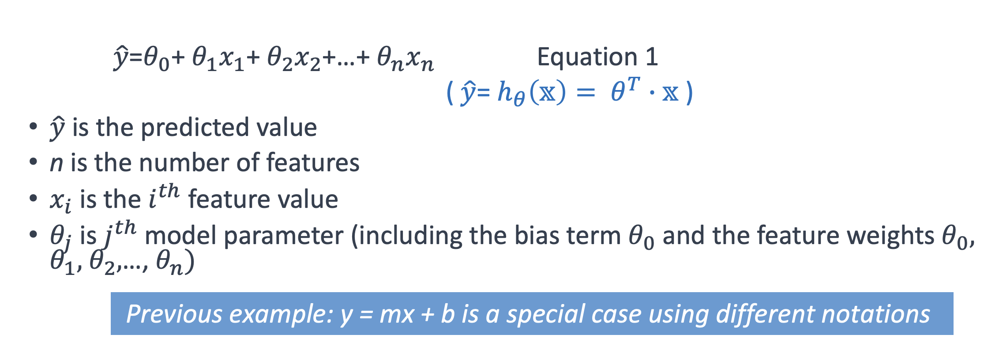
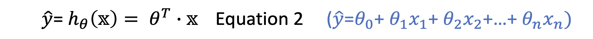

# Week 2


## Training a Machine Learning Model

- Traning a machine learning model is a matter of closing the gap between the model's predictions and the observed training data labels.

  

## Linear Regression and Gradient Decent

#### Regression Problem

Predict real-value output

#### Example: Model trained to predict house prices

Training set of housing prices:

| Size in feet ^2 (x) | Price ($) in 1000's (y) |
| ------------------- | ----------------------- |
| 2104                | 460                     |
| 1416                | 232                     |
| 1534                | 315                     |
| 852                 | 178                     |
| ...                 | ...                     |

```
Notation:
n = number of training examples
x's = 'input' variables / features
y's = 'output' variables / target
```




#### Linear Regression and Gradient Decent

- The goal of linear regression is to fit a line to a set of points
- Let's suppose we want to model this set of points with a line, we can use y=mx+b
- We need to **measure** how **good** a given line is
- We will define an **error** function (also called a **cost function** or **loss function**)
- This function will take in a (m,b) pair and return an error value based on how well the line fits our data.
  - To compute this error for a given line, we'll iterate through each (x,y) point in our data set and sum the square distances between! each points y value and the candidate lines y value (computed at mx +b).



```python
# y = mx + b
# m is the slope, b is the y-intercept

def compute_error_for_line_given_points(b,m,points):
  totalError = 0
  for i in range (0, len(points)): 
    totalError += (points[i].y - (m*[points[i].x + b])) ** 2
  return totalError / float(len(points))
  
```

- Lines that fit our data better will result in lower error values
- If we minimize this function, we will get the best line for our data
- Since our error function consists of two parameters (m and b) we can visualize it as a two-dimensional surface:




- Each point in this two-dimensional space represents a line (a model or hypothesis)
- The height of the function at each point is the error value for that line.
- Some lines yield smaller error values than others (i.e that fit our data better)
- When running the gradient decnet search, we will start from some location on this surface and move downhill to find the line with the lowest error.

## Gradient Decent

#### What is it?

This is an algorithm that minimizes functions

- It is one of the most popular algorithms to perform optimization and by far the most common way to optimize neural networks.
- Starts with an initial set of parameter values and iteratively moves toward a set of parameter values that **minimize** the function.
  - This iterative minimization is achieved using calculus, taking steps in the negative direction of the function gradient

#### Using it

- To run gradient descent on this error function (the one mentioned earlier ^^ ), we first need to compute its gradient
  - need to differentiate the error function
- Since this error function is defined by two parameters (m and b), we will nmeed to compute a partial derivative for each. These derivatives work out to be:



```python
def step_gradient(b_current, m_current, points, learning_rate):
  b_gradient = 0
  m_gradient = 0
  N = float(len(points))
  for i in range(0,N):
    b_gradient += -(2/N) * (points[i].y - ((m_current*points[i].x) + b_current)) 
    m_gradient += -(2/N) * points[i].x * (points[i].y - ((m_current * points[i].x) +b_current))
  new_b = b_current - (learning_rate * b_gradient)
  new_m = m_current - (learningRate * m_gradient)
  return [new_b, new_m]
```

```learning_rate``` controls the size of a step we take downhill during each iteration.


## More Generally: Training Models

**Most topics discussed here will be essential in understanding, building, and training neural networks**

#### Two very different ways to train it:

- **Closed-form** equation that directly computes the model parameters that best fit the model to the training set 
- Using an iterative optimization approach called **Gradient Decent** that gradually tweaks the models parameters to minimize the cost / error function over the training set, eventually converging to the same set of parameters as the first method.
- A few variants of Gradient Descent that are frequently used in neural networks: Batch GD, Mini-batch GD, and Stochastic GD

#### We will generalise concepts on:

- Linear regression
- Polynomial Regression
  - fit nonlinear dataset, with more parameters
    - more prone to overfitting the training data
  - how to detect overfitting learning curves
  - regularization techniques to reduce the risk of overfitting the training set,
- two more models that are commonly used for classification tasks:
  - Logitic Regression
  - Softmax Regression

#### Linear Regression - more general with more features

- Linear model makes a prediction by simply computing a **weighted sum** of the input features, plus a constant called the bias term (also called the *intercept term*) as shown in Equation 1



#### Linear Regression 

- This can be written more consisely using a vectorized form, as shwon in Equation 2



- $\theta$ is the model's parameter vector, containing the bias term $\theta_0$ and the feature weights $\theta_0$ to $\theta_n$
- $\theta^T$ is the transpose of $\theta$ (a row vector instead of a column vector)
- 

