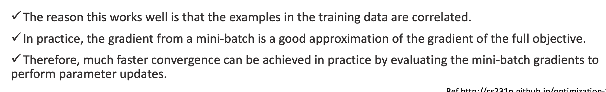

#  Week 2


## Training a Machine Learning Model

- Traning a machine learning model is a matter of closing the gap between the model's predictions and the observed training data labels.

  

## Linear Regression and Gradient Decent

#### Regression Problem

Predict real-value output

#### Example: Model trained to predict house prices

Training set of housing prices:

| Size in feet ^2 (x) | Price ($) in 1000's (y) |
| ------------------- | ----------------------- |
| 2104                | 460                     |
| 1416                | 232                     |
| 1534                | 315                     |
| 852                 | 178                     |
| ...                 | ...                     |

```
Notation:
n = number of training examples
x's = 'input' variables / features
y's = 'output' variables / target
```


#### Linear Regression and Gradient Decent

- The goal of linear regression is to fit a line to a set of points
- Let's suppose we want to model this set of points with a line, we can use y=mx+b
- We need to **measure** how **good** a given line is
- We will define an **error** function (also called a **cost function** or **loss function**)
- This function will take in a (m,b) pair and return an error value based on how well the line fits our data.
  - To compute this error for a given line, we'll iterate through each (x,y) point in our data set and sum the square distances between! each points y value and the candidate lines y value (computed at mx +b).


```python
# y = mx + b
# m is the slope, b is the y-intercept

def compute_error_for_line_given_points(b,m,points):
  totalError = 0
  for i in range (0, len(points)): 
    totalError += (points[i].y - (m*[points[i].x + b])) ** 2
  return totalError / float(len(points))
  
```

- Lines that fit our data better will result in lower error values
- If we minimize this function, we will get the best line for our data
- Since our error function consists of two parameters (m and b) we can visualize it as a two-dimensional surface:


- Each point in this two-dimensional space represents a line (a model or hypothesis)
- The height of the function at each point is the error value for that line.
- Some lines yield smaller error values than others (i.e that fit our data better)
- When running the gradient decnet search, we will start from some location on this surface and move downhill to find the line with the lowest error.

## Gradient Decent

#### What is it?

This is an algorithm that minimizes functions

- It is one of the most popular algorithms to perform optimization and by far the most common way to optimize neural networks.
- Starts with an initial set of parameter values and iteratively moves toward a set of parameter values that **minimize** the function.
  - This iterative minimization is achieved using calculus, taking steps in the negative direction of the function gradient

#### Using it

- To run gradient descent on this error function (the one mentioned earlier ^^ ), we first need to compute its gradient
  - need to differentiate the error function
- Since this error function is defined by two parameters (m and b), we will nmeed to compute a partial derivative for each. These derivatives work out to be:


```python
def step_gradient(b_current, m_current, points, learning_rate):
  b_gradient = 0
  m_gradient = 0
  N = float(len(points))
  for i in range(0,N):
    b_gradient += -(2/N) * (points[i].y - ((m_current*points[i].x) + b_current)) 
    m_gradient += -(2/N) * points[i].x * (points[i].y - ((m_current * points[i].x) +b_current))
  new_b = b_current - (learning_rate * b_gradient)
  new_m = m_current - (learningRate * m_gradient)
  return [new_b, new_m]
```

```learning_rate``` controls the size of a step we take downhill during each iteration.


## More Generally: Training Models

**Most topics discussed here will be essential in understanding, building, and training neural networks**

#### Two very different ways to train it:

- **Closed-form** equation that directly computes the model parameters that best fit the model to the training set 
- Using an iterative optimization approach called **Gradient Decent** that gradually tweaks the models parameters to minimize the cost / error function over the training set, eventually converging to the same set of parameters as the first method.
- A few variants of Gradient Descent that are frequently used in neural networks: Batch GD, Mini-batch GD, and Stochastic GD

#### We will generalise concepts on:

- Linear regression
- Polynomial Regression
  - fit nonlinear dataset, with more parameters
    - more prone to overfitting the training data
  - how to detect overfitting learning curves
  - regularization techniques to reduce the risk of overfitting the training set,
- two more models that are commonly used for classification tasks:
  - Logitic Regression
  - Softmax Regression

#### Linear Regression - more general with more features

- Linear model makes a prediction by simply computing a **weighted sum** of the input features, plus a constant called the bias term (also called the *intercept term*) as shown in Equation 1


#### Linear Regression 

- This can be written more consisely using a vectorized form, as shwon in Equation 2


- $\theta$ is the model's parameter vector, containing the bias term $\theta_0$ and the feature weights $\theta_0$ to $\theta_n$
- $\theta^T$ is the transpose of $\theta$ (a row vector instead of a column vector)
- X is the instance's feature vector, containing $x_0$ and $x_n$ , with $x_0$, always equalt o 1
- $\theta^T \dotproduct x$ is the dot product of $\theta^T$ and x
- $h_0$ is the hypothesis function, using the model parameters $\theta$


#### Linear Regression - How to train it?

- Training a model means setting its parameters so that the model best fits the training set
- First need to measure how well the model fits the training data.
- Mean Square Error (MSE)
- 
- m is the number of instances in the dataset
- The more common performance measure of a regression model is the error function used earlier


#### The Normal Equation

- To find the value of $\theta$ that minimises the cost function, there is a *closed-form solution* - in other words, a mathematical equation that gives the result directly. This is called the *Normal Equation*


#### Gradient Decent

- GD is a generic optimization algorithm capable of finding optimal solutions to a wide range of problems
- The general idea of GD is to tweak parameters iteratively in order to minimize a cost function
- It measures the local gradient of the error function with regards to the parameter vector $\theta$, and it goes in the direction of descending gradient.
- Once the gradient is zero, you have reached a minimum 


#### Process:

- Start with random $\theta$
- take one baby step at a time, each step attempting to decrease the cost function 
- until the algorithm *converges* to a minimum


#### Gradient Decent - learning rate

- if the learning rate is too small, then the algorithm will have to go through many iterations to converge.
- If th elearning rate is too high, you might jump across the valley and end up on the other side, possibly even higher up than you were before
  - This might make the algorithm diverge, with larger and larger values, failing to find a good solution


#### Batch Gradient Decent

- To implement Gradient Decent, we need to calculate how much the cost function will change if we change $\theta_j$ just a little bit. This is called a partial derivative.
- 
- 


#### Stochastic Gradient Descent 

- Stochastic Gradient Descent picks a random instance in the training set at every step and computes the gradients based only on that single instance. - fast
- Irregular: instead of gently decreasing until it reaches the minimum, the cost function will bounce up and down, decreasing only on average.
- When the cost function is very irregular, this can actually help the algorithm jump out of a local minima so Stochastic Gradient Descent has a better chance of finding the global minimum that Batch Gradient does


#### Mini-batch Gradient Descent

- At each step, computes the gradients on small random sets of instances called *mini-batches*
- The main advantages of Mini-batch GD over Stochastic GD is that you get a performance boost from hardware optimization of matrix operations, especially when using GPUs
- The algorithm's progress in parameter space is less erratic than with Stochastic GD, especially with farily large mini batches.



#### 


## Polynomial Regression

- What if your data is more complex than a straight line? Surprisingly, you can use a linear model to fit nonlinear data. A simple way to do this is to add powers of each feature as new features, then train a linear model on this extended set of features. This technquie is called *Polynomial Regression*


#### Learning Curves

If you perform high-degree Polynomial Regression, you will likely fit the training data much better than with plain Linear Regression. Figure below applies a 300 degree polynomial model to the preceeding training data, and compares the result with a pure linear model and a quadratic model.


#### The Bias / Variance Trade-off

- Bais: This part of the generalization error is due to wrong assumptions, such as assuming that the data is linear when it is actually quadratic. A high-bias model is most likely to underfit the training data.
- Variance: This is part due to the models excessive sensitivity to small variations in the training data. A model with many degrees of freedom (such as high-degree polynomial model) is likely to have high variance and thus overfit the training data.
- Irreducible error: This part is due to the noisiness of the data itself. The only way to reduce this part of the error is to clean up the data (fix the data sources, such as broken sensors or detect and remove outliers)
- **Increasing a model's complexity will typically increase its variance and reduce its bias.**
- **Conversely, reducing a model's complexity increases its bias and reduces its variance.** This is why its called a trade-off


#### Addressing Overfitting:

**Options**:

1. Reduce number of features:
   - Manually select which features to keep.
   - Model selection algorithm.
2. Regularization.
   1. Keep all the features, but reduce magnitude / values of parameters
   2. Works well when we have a lot of features, each of which contrivutes a bit to predicting $y$


#### Regularized Linear Models

- A good way to reduce overfitting is to regularize the model (to constrain it): the fewer degrees of freedom it has, the harder it will be for it to overfit the data.

  - A simple way to regularize a polynomial model is to reduce the number of polynomial degrees.

- For a linear model, regularization is typically achieved by constraining the weights of the model.

  


- A very differnet way to regularize iterative learning algorithms such as Gradient Descent is to stop training as soon as the validation error reaches a minimum.
- As the epochs go by the algorithm learns, and its prediction error (RMSE) on the training set goes down, along with its prediction error on the validation set.
- After a while, the validation error stops decreasing and starts to go back up. This indicates that the model has started to overfit the training data.
- You just stop training as soon as the validation error reaches the minimum.


## Logistic Regresssion 


#### Classification

Email: Spam / Not Spam ?

Online Transactions: Fraudulent (Yes / No) ? 

Tumor: Malignant / Benign


- The output for linear regression is a number that has its real meaning
- The output for a logistic regression is a number that represents the probability of the event happening
- Logisitc Regression (also called Logit Regression) is commonly used to estimate the probability that an instance belongs to a particular class.


