# Week 3 - Introduction to Neural Networks

## Characteristics of Neural Networks

- Biological inspiration
- Brain vs artificial neural network
- The perceptron
- Multilayer neural networks
- Supervised and unsupervised neural networks

## Articial Neural Networks

- An NN consists of a number of very simple processors, also called neurons.
- The neurons are connected by weighted links passing signals from one neuron to another.
- The output signal is transmitted throught the neuron's outgoing connection. The outgoing connection splits into a number of branches that transmit the same signal.
- The outgoing branches terminate at the incoming connections of other neurons in the network.

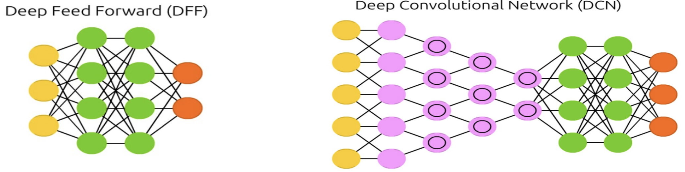

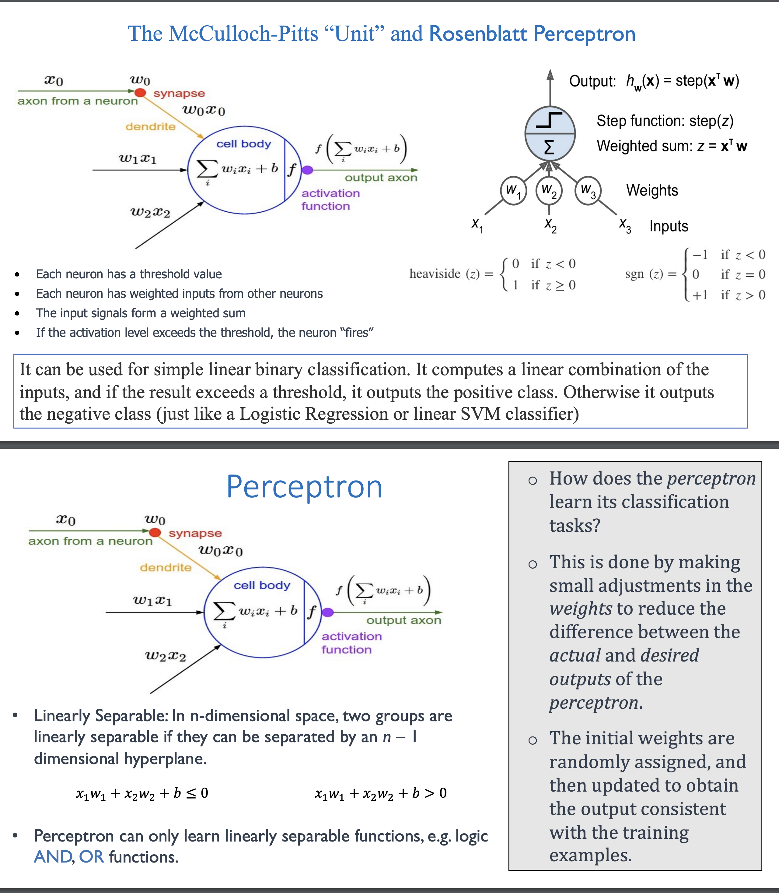

## Perception Training Algorithm

Step 1: **Initialization** (assign weights, threshold with random values)

Step 2: **Activation**

Apply input and desired output, and compute the actual output at iteration as p.

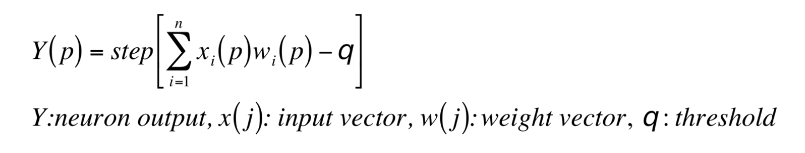

Step 3: Update the weights of the perceptron

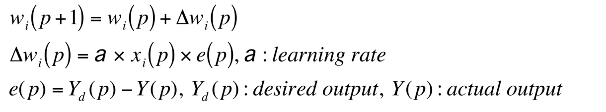

Step 4: Increase **p** by 1, go back to step 2 and repeat the process until convergence.

## Supervised Learning - Back-propagation Neural Network

- A training set of inputs is presented to the network
- Feed forward to compute its output, and if there is an error, or a difference between actuakl and desired output patterns - the weights are adjusted to reduce this error.
- Can learn to solve linearly inseparable problems.

## The Multilayer Perceptron and Backpropagation

- For each training instance, the backpropagation algorithm first makes a prediction (forward pass) and measures the error, then goes through each layer in reverse to measure the error contribution from each connection (reverse pass), and finally tweaks the connection weights to reduce the error (Gradient Descent step).

## Feed Forward Network

 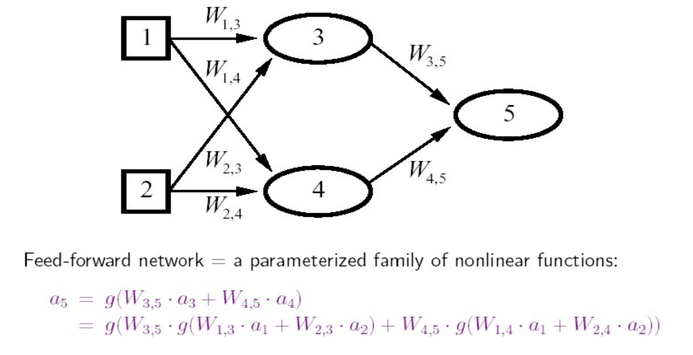

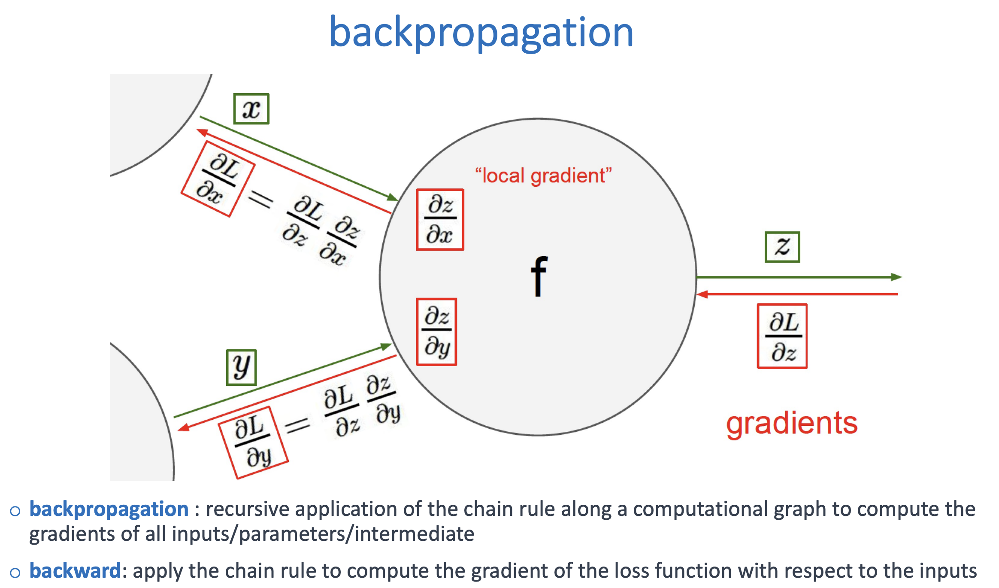

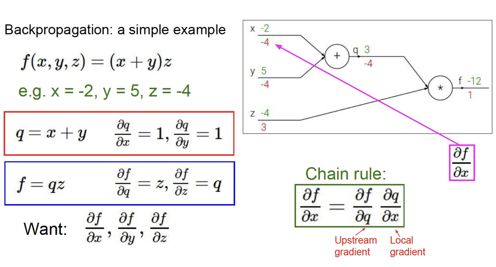

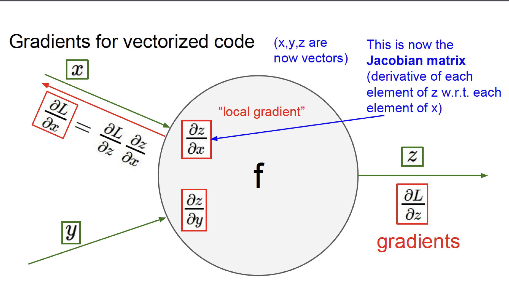

## Hyperparameters and Training

- **Hyperparameters**: Number of layers, Number of neurons, learning rate
- **Training**:
  - Stop if the error fails to improve (has reach a minimum)
  - Stop if the rate of improvement drops below a certain level
  - Stop if the error reaches an acceptable level
  - Stop when a certain number epochs have passed
  - Regularization strategies 
  - Cross validation

## Activation Functions

#### **Why do we need activation functions? **

- They transform neuron's input into output.
- If you chain several linear transformations, all you get is a linear transformation.

#### **Commonly used activation functions**

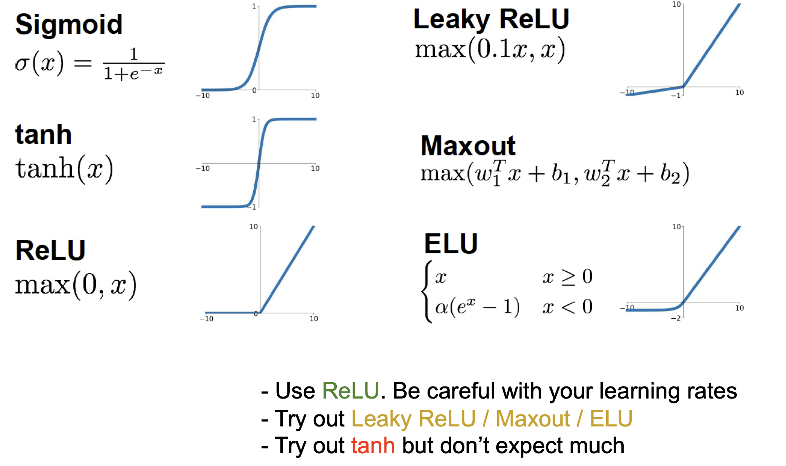

## Regression MLPs and Classification MLPs

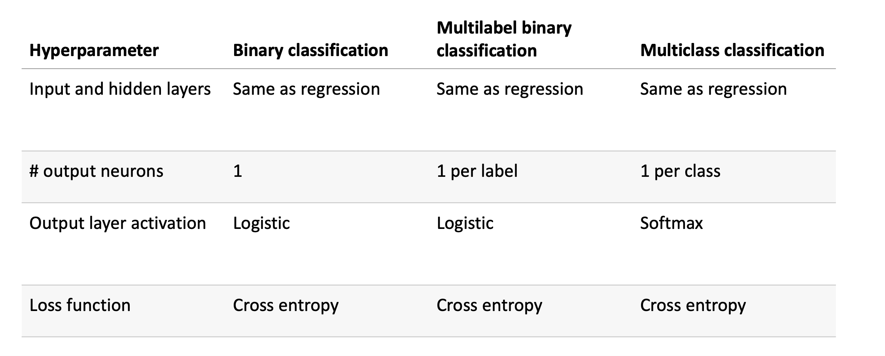

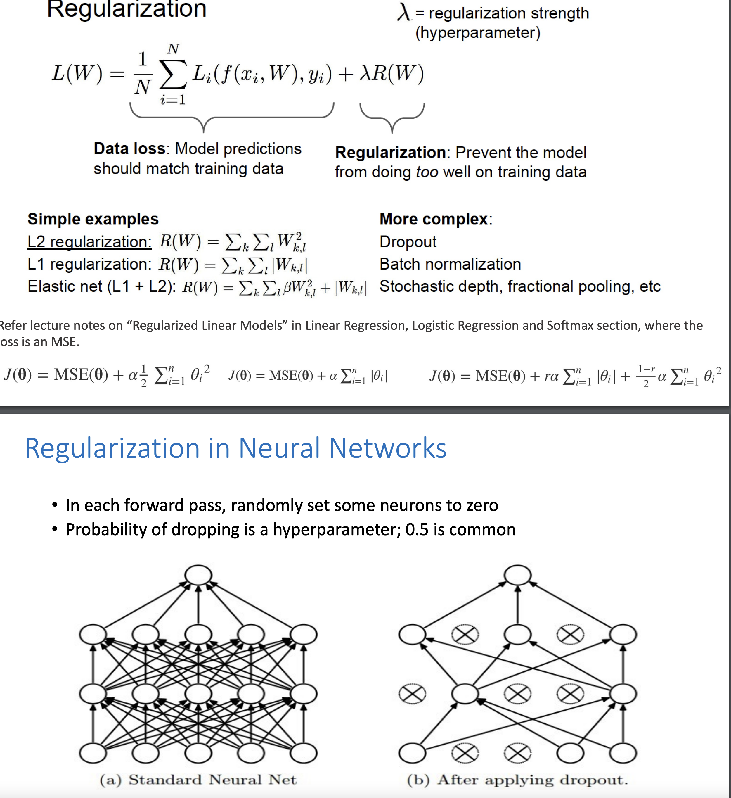