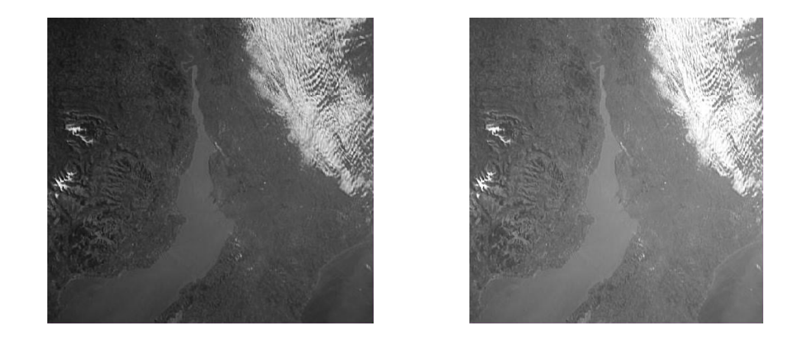
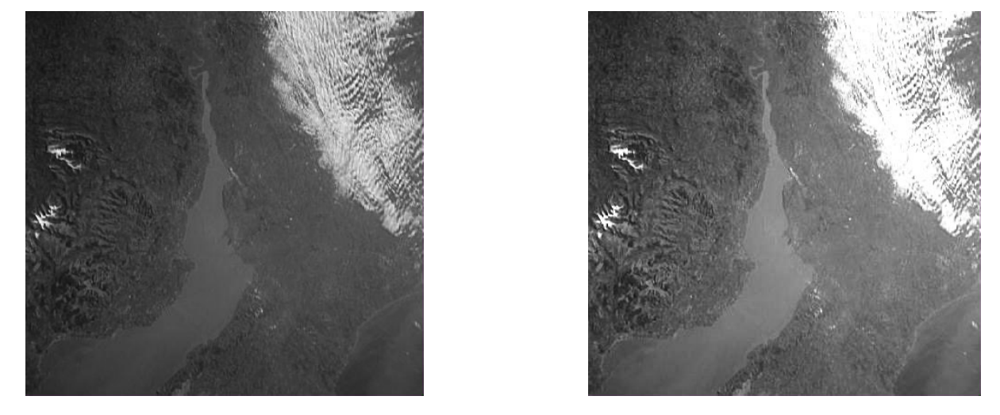
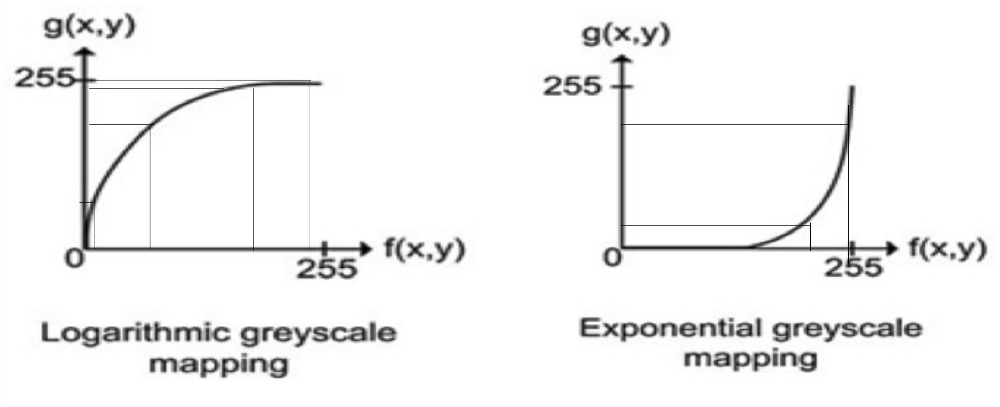

# Week 4 - Image Proccessing


## Classification of Image Transforms

#### Types

- Point transforms
  - Modify individual pixels
  - Modify pixels' locations
- Local transforms
  - Output derived from neighbourhood
- Global transforms
  - Whole image contributes to each output value


#### Point Transforms

- Manipulating individual pixel values
  - Brightness adjustments
  - Contrast adjustment
- Histogram manipulation
  - Equalisation
- Image magnification


#### **Brightness Adjustments**

Also called intensity shift - add a constant to all values $g(x,y) = f(x,y) + k$




#### Constrast Shift

$g(x,y) = a * f(x,y)$

Where (x,y) are pixel coordinates, f and g are input and output images respectively. Scale all values by a constant.



#### Put together - Brightness and contrast enhancement

If we do not want to specify a gain *a* and a bias *b*, but would rather map a particular range of grey levels, [f1, f2], onto a new range [g1,g2]. This form of mapping is accompplished using 

$g(x,y) = a* f(x,y) + b$

$\frac{g(x,y) - g_1}{f(x,y) - f_1} = \frac{g_2 - g_1}{f_2 - f_1} $ i.e

$g(x,y) = g_1 + (\frac{g_2 - g_1}{f_2 - f_1})(f(x,y) - f_1)$


#### Linear and non-linear mapping

$g(x,y) = a* f(x,y) + b$

- If 'a' is a constant, then it is a linear mapping
- When 'a' is a function, then it is non-linear mapping
- Non-linear mapping functions have a useful properties: the gain, 'a' applied to input grey level, can carry. Thus the way in which constrast is modified depends on the input grey level
- If a range of grey levels are mapped to a wider range of grey levels, the contrast is enhanced.
- If a range of grey levels are mapped to a narrower range of grey levelsm the contrast is reduced.


#### Non-linear mapping

- Generally, logarithmic mapping is to enhance details in the darker regions of the image, at the expense of detail in the brighter regions
- Exponential mapping has a reverse effect, contrast in the brighter parts of an image is increased at the expense of contrast in the darker parts.



#### Calculation of an image histogram

```
Create an array histogram with 2^b elements

for all grey levels, i, do
	histogram[i] = 0
end for

for all pixel coordinates, x and y, do
	increment histogram [f(x,y)] by  1
end for
```

