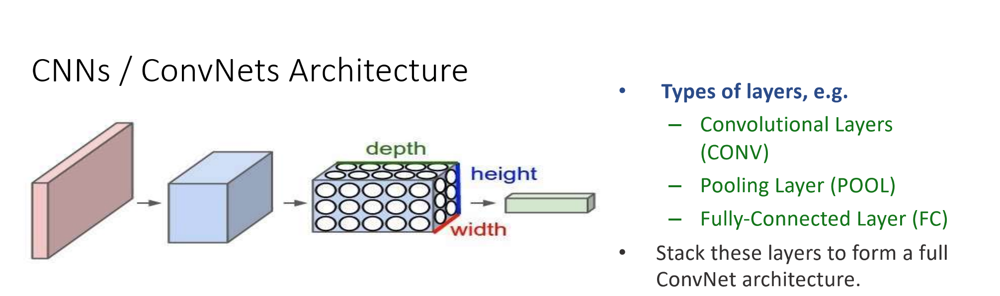

# Week 5 - Convolutional Neural Networks

CNNs power in object recognition, object detection, image search services, self-driving cards, automatic video classification systems, and more.

They are not restricted to visual perceptron:

- Voice / speech recognition
- Natural language processing

## CNN Architecture

- A conv net arranges its neurons in three dimensions (w,h,d).
- Red input layer holds the image, so its width and height will be the dimensions of the image and the depth would be the number of channels (RGB = 3, Greyscale =1)
- A conv net is made up of layers. Each transform

### Types of layers

