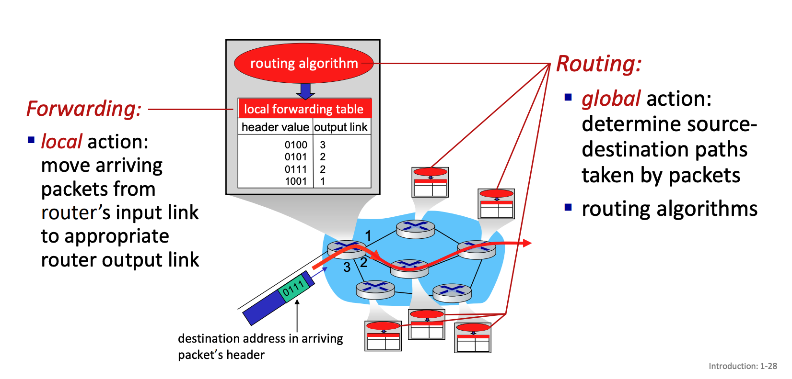

# Week 1


## The internet


#### Nuts and Bolts view

**Internet** - interconnected ISPs

**Protocols** - control sending, receiving of messages

**Internet Standards**: 

- **RFC** - request for comments
- **IETF** - internet engineering task force

**There are billons of computing devices conecting**:

- Hosts = end systems
- Running network apps a the internet's edge.

**Packet switches**: forward packets (chunks of data)

- Routers, switches

**Communication Links**

- Fibre, copper, radio, satellite
- Transmission rate: bandwidth

#### Service view

Internet provides infrastructure that provides services to applications such as:

- Web
- Streaming video
- Security
- Social Media

Internet provides programming interface to distributed applications:

- "hooks" allowing sending / recieving apps to "connect" to, use Internet transport service
- provides service options, analogous to postal service


## What's a protocol?


**Definition**: **Protocols** define the **format**, **order** of **messages sent and recvieved** among network entities and **actions taken** on msg transmission, receipt.

All communication activity in the internet governed by protocols

... specific messages sent ... specific actions taken when messages recieved or other events


## A closer look at internet structure


#### Network edge:

- Hosts: **clients and servers**
- Servers often in data centers

#### Access networks, physical media

- **Wired, wireless communication links**

#### Network core:

- **interconnected routers**
- network of networks


## Access networks and physical media

#### Q: How to connectt end systems to edge router?

- residential access nets
- instituational access networks (schools, company)
- mobile access networks (4g/5g)

#### What to look for:

- transmission rate (bits per second) of access network
- shared or dedicated access among users?

#### Cable-based access:

- HFC: Hybrid fiber coax
  - asymmetric: up to 40Mbs - 1.2 Gbs downstream transmission rate, 30-100 Mbps upstream transmission rate
- Network of cable, fiber attaches homes to ISP router
  - home shares access network to cable headend

#### Digital subscriber line (DSL)

- use **existing** telephone line to central office DSLAM
  - data over DSL phone line goes to internet
  - voice of DSL phone line goes to telephone net
- 24-52 Mbps dedicated downstream transmission rate
- 3.5-16 Mbps dedicated upstream transmission rate

#### Wireless access networks

Shared wireless access network connects end system to router

- via bvase station aka "access point"

Wireless local area networks (WLANS)

- typically within or around building ~100ft
- 802.11b/g/n (WiFi): 11, 54, 450 Mbps transmission rate

#### Enterprise networks

- companies, universities, etc.
- mix of wired, wireless link technologies, connecting a mix of switches and routers
  - Ethernet: wired access at 100Mbps, 1Gbps, 10Gbps 
  - WiFi: wireless access points at 11, 54, 450 Mbps

#### Host: Send packets of data

host sending function:

- takes application message
- breaks into smaller chunks, known as **packets**, of length **L** bits
- transmits packet into access network at **transmission rate R**
  - link transmission rate, aka lionk **capacirty, aka link bandwidth**

```
packet transmission delay = time needed to transmit L-bit packet into link = L/R

Where L is bits and R is bits per second
```

#### Links: Physical media

**Wireless radio**

- Broadcast and "half-duplex" (sender to receiver)
- Propagation environment effects:
  - reflection
  - obstrcution by objects
  - interference

## The network core

- mesh of interconnected routers
- packet-switching: host break application-layer messages into packets
  - forwards packets from one router to the next, across links on path from source to destination
  - each packet transmitted at full link capacity

#### Packet-switching: store-and-forward

Source --------> router ----------> destination

- Transmission delay (amount of time it takes to transmit): takes L/R seconds to transmit (push out) L-bit packet into link at R bps
  - Where L is bits per packet
  - R is transmission bits per second
- Store and forward: entire packet must arrive at router before it can be transmitted on next link
- End-end delay: (2*L) / R, assuming zero propagation delay

#### Packet-switching: queueing delay, loss

Packet queuing and loss: if arrival rate (in bps) to link exceeds transmission rate (bps) of link for a period of time:

- Packets will queue, waiting to be transmitted on output link
- packets can be dropped (lost) if memory (buffer) in router fills up

#### Two key network-core functions

**Forwarding**

- local action: move arriving packets from router's input link to appropriate router output link

**Routing**

- Global action: determine source-destination paths taken by packets
- Routing algorithms

#### Alternative to packet switching: circuit switching

end-end resources allocated to, reserved for 'call' between source and destination


**Circuit switching**: A method used to send information such as phone calls. A dedicated path / circuit / channel is decided before the transfer of data begins. This ensures that the circuit is dedicated to the connection.

**Packet switching**: A method used by the internet today to transfer data. When data is broken up into packets each packet contains a destination IP address and an ordering index so they can take any route / path they want to take, it doesn't matter because the ordering and validation of data will happen at the other side.

#### Circuit switching: FDM and TDM

Frequency Division Multiplexing: 

- Optical, electromagnetic frequencies divided into (narrow) frequency bands
- Each call allocated its own band, can transmit at max rate of that narrow band

Time Division Multiplexing:

- Time divided into slots
- Each call allocated periodic slots, can transmit at maximum rate of (wider) frequency bands, but only during its time slot

#### Packet switching vs Circuit switching

Packet switching allows more users to use the network

Example: 

- 1 Gb/s link
- each user:
  - 100Mb/s when active
  - active 10% of the time
- Circuit switching: 10 users
- Packet switching: with 35 users, probability > 10 active same time is .0004
