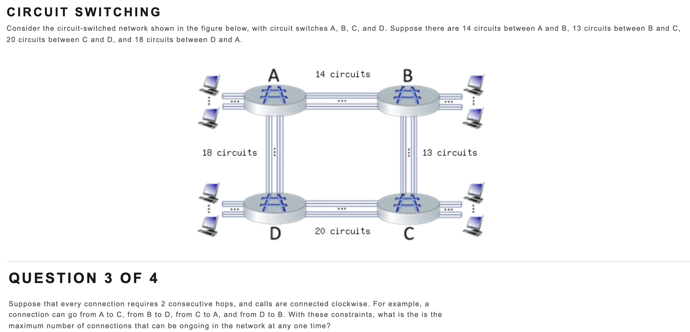

# Summary

## Part 1 

1. Match statement to view point

   

   The internet is:

   - A collection of billions of computing devices, and packet switches interconnected by links = nuts-and-bolts
   - A platform for building network applications = services
   - A network of networks = nuts-and-bolts
   - A place I go for information, entertainment, and to communicate with people = services

   

## Part 2

1. Match network technology to speed and media:

   

   1. 802.11 WiFi = 10's to 100's Mbps, wireless

   2. Digital Subscriber Line (DSL) = Up to 10's Mbps downstream per user, wired

   3. Cable access network = Up to 10's to 100's of Mpbs downstream per user, wired

   4. Ethernet = Up to 100's Gbps, wired

   5. 4G cellular (LTE) = Up to 10's Mbps, wireless

      

2. Which of the following physical layer technologies has the highest transmission rate and lowest bit error rate in practice:

   

   1. Co-axial cable
   2. Satellite channel
   3. 802.11 (WiFi) radio channel
   4. Fiber optic cable = true
   5. Twisted pair

## Part 3

The maximum connections in a circuit switched network is a sum of all of the links. (If there are no hops)

Hint: Find the max between the sum of the bottleneck links for cases A->C and B->D, but don't forget about bottleneck links

Sum of bottleneck links for case A->C: 16+13 = 29

Sum of bottleneck links for case B->D = 13+16 = 29

Answer = 26

24

Consider routes A->C and C->A and sum bottleneck links. 13 for A->C and 18 for C->A 13+18 = 31

Consider routes B->D and D->B and sum bottleneck links. 13+

Answer = 31